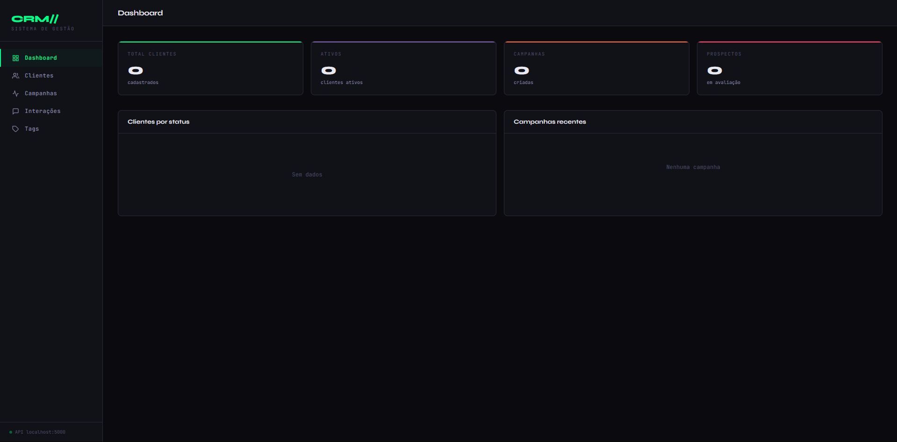

# CRM// Sistema de Gestão


> Sistema completo de CRM (Customer Relationship Management) com dashboard interativo, gestão de clientes, campanhas de marketing, interações e tags.

---

## 📸 Preview



---

## ✨ Funcionalidades

- 📊 **Dashboard** — Métricas em tempo real: clientes, ativos, campanhas e prospectos
- 👥 **Clientes** — Cadastro completo com status, origem, tags e histórico
- 📣 **Campanhas** — Criação e acompanhamento por canal (email, WhatsApp, SMS)
- 💬 **Interações** — Registro de reuniões, ligações, e-mails e WhatsApp
- 🏷️ **Tags** — Categorização e segmentação de clientes
- 🔌 **API REST** — Backend completo com Flask e SQLAlchemy

---

## 🗂️ Estrutura do Projeto

```
CRM-SYSTEM/
├── frontend/
│   └── index.html          # Interface completa (HTML + CSS + JS)
├── backend/
│   ├── app/
│   │   ├── __init__.py     # App factory + extensões
│   │   ├── models/
│   │   │   └── __init__.py # Modelos SQLAlchemy
│   │   └── routes/
│   │       ├── clients.py       # CRUD de clientes
│   │       ├── contacts.py      # Contatos por cliente
│   │       ├── campaigns.py     # Campanhas de marketing
│   │       ├── interactions.py  # Histórico de interações
│   │       └── tags.py          # Tags/labels
│   ├── tests/
│   │   └── test_api.py     # Testes com pytest
│   ├── config.py           # Configurações por ambiente
│   ├── run.py              # Entry point
│   ├── seed.py             # Popular banco com dados de exemplo
│   ├── requirements.txt
│   └── .env.example
├── iniciar.bat             # Setup automático (Windows)
└── README.md
```

---

## 🚀 Como rodar o projeto

### Opção 1 — Script automático (Windows)

Basta dar **duplo clique** no arquivo `iniciar.bat`. Ele vai:
- Verificar o Python
- Criar o ambiente virtual
- Instalar as dependências
- Configurar o banco de dados
- Iniciar o servidor

### Opção 2 — Manual

```bash
# Entre na pasta do backend
cd backend

# Crie um ambiente virtual
python -m venv .venv
.venv\Scripts\activate        # Windows
source .venv/bin/activate     # Linux/Mac

# Instale as dependências
pip install -r requirements.txt

# Configure o .env
copy .env.example .env

# Popule o banco com dados de exemplo
python seed.py

# Inicie o servidor
python run.py
```

Depois abra o arquivo `frontend/index.html` no navegador.

O servidor estará em: **http://localhost:5000**

---

## 📡 Endpoints da API

| Método | Rota | Descrição |
|--------|------|-----------|
| GET | `/api/health` | Status da API |
| GET/POST | `/api/clients/` | Listar / Criar clientes |
| GET/PUT/DELETE | `/api/clients/:id` | Detalhar / Editar / Remover |
| GET | `/api/clients/stats` | Estatísticas gerais |
| GET/POST | `/api/campaigns/` | Listar / Criar campanhas |
| POST | `/api/campaigns/:id/send` | Marcar como enviada |
| GET/POST | `/api/interactions/` | Listar / Registrar interações |
| GET/POST | `/api/tags/` | Listar / Criar tags |

---

## 🛠️ Tecnologias

| Camada | Tecnologia |
|--------|------------|
| Frontend | HTML5, CSS3, JavaScript |
| Backend | Python, Flask, SQLAlchemy |
| Banco de dados | SQLite |
| API | REST + Flask-CORS |

---

## 👨‍💻 Autor

Feito por **Alexandre** — [@alexandresdev21](https://github.com/alexandresdev21)
